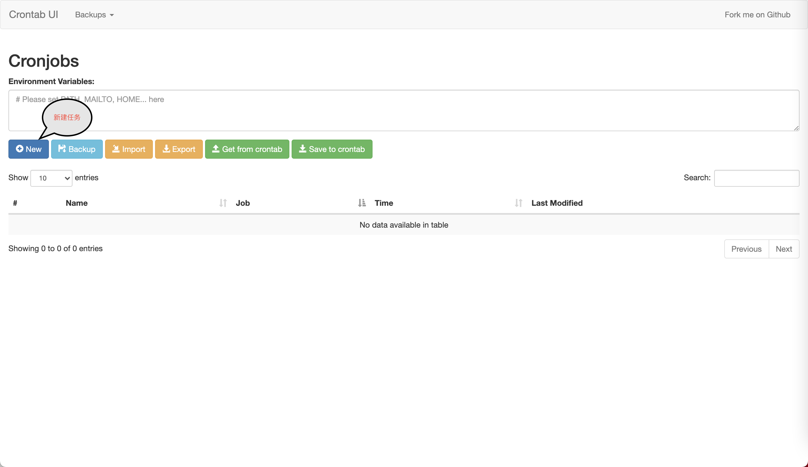
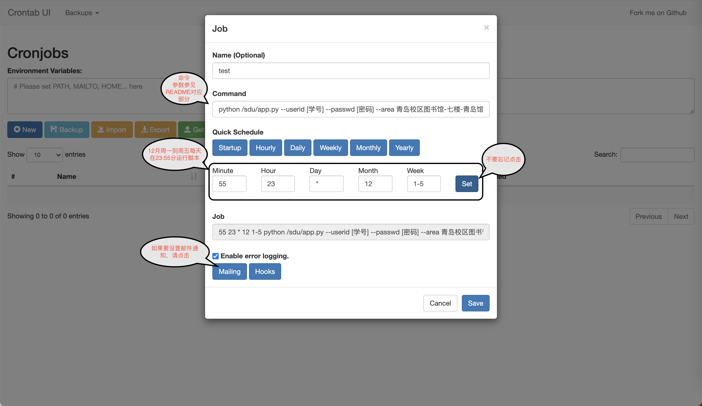
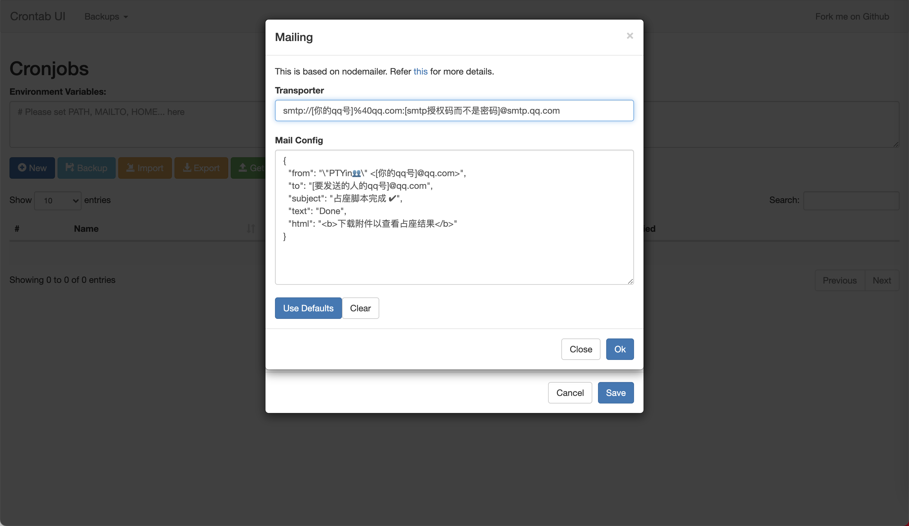
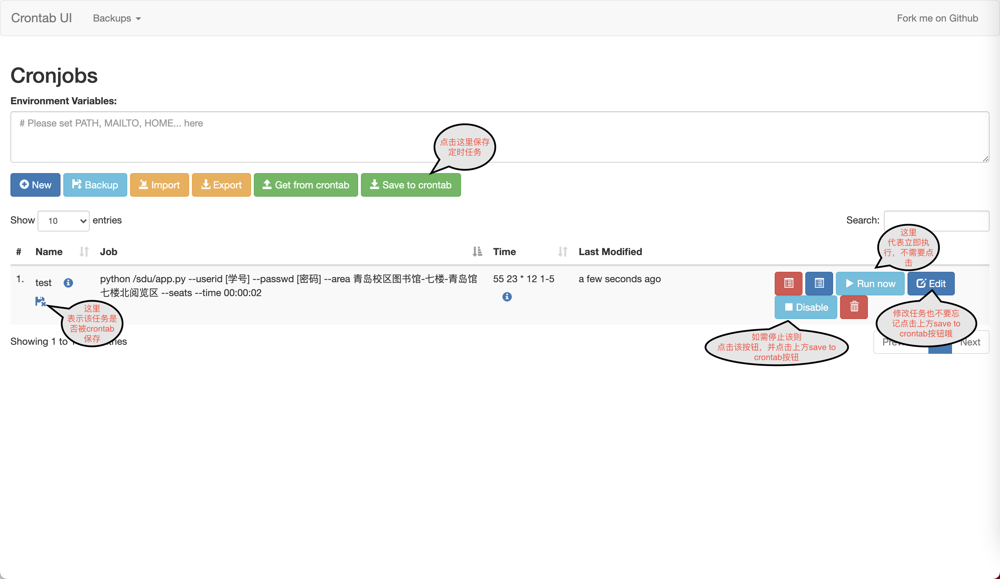

<h2 align="center">SDU-LIB-SEAT</h2>

## 使用前须知

**项目仅供学习交流使用，这是个不错的 `Python爬虫`学习项目，请不要将其用于商业用途，更不要有偿出图书馆座位！**

### CHANGE LOG
- [x] 2022/04/05 针对预约系统仅支持校园网访问，提出使用[docker-easyconnect](https://github.com/Hagb/docker-easyconnect)，通过使用SDU的VPN系统来让本软件访问预约系统,暂只适配[基本的命令行运行](#命令行用法)使用方式
- [x] 2022/04/01 解决威海校区分时段预约座位问题
- [x] 2022/02/20 图书馆空间预约系统UI变动导致爬虫进程失效，已适配
- [x] 2022/02/16 图书馆开放预约时间调整为06:00，目前脚本已经适配，默认06:02:00预约

---

## 两种使用方式：
1. [基本的命令行运行](#命令行用法)
2. [直观的图形化界面](#图形界面管理)

## 命令行用法

### 下载和安装

```shell
git clone https://github.com/PTYin/sdu-lib-seat.git
# 如使用图形界面则需带参数--recurse-submodules
# git clone --recurse-submodules https://github.com/PTYin/sdu-lib-seat.git
# 切换进入项目目录
cd sdu-lib-seat
# 安装python依赖
pip install -r requirements.txt
# 若由于网络问题无法获取依赖，请执行
pip install -r requirements.txt -i https://pypi.tuna.tsinghua.edu.cn/simple/
```

### 使用代理

为了解决预约系统仅支持校园网访问，采用[docker-easyconnect](https://github.com/Hagb/docker-easyconnect)建立vpn连接，该docker支持配置socks5代理和http连接。于是我们需要先去pull该docker镜像，并根据使用文档运行该镜像,操作方法如下：

(若系统没有安装docker或版本过老,请参考[安装Docker并运行](https://docs.docker.com/get-docker/)或自行百度或谷歌搜索)

```shell
# 拉取镜像
docker pull hagb/docker-easyconnect:cli
# 运行容器,socks5端口为1080,http代理端口8888
docker run -d --device /dev/net/tun --cap-add NET_ADMIN -ti -p 127.0.0.1:1080:1080 -p 127.0.0.1:8888:8888 -e EC_VER=7.6.3 -e CLI_OPTS="-d https://vpn.sdu.edu.cn -u 山东大学学工号 -p 山东大学统一身份认证密码" hagb/docker-easyconnect:cli
```

之后可以通过`docker ps`查看是否正在运行，并可以通过`docker logs 容器id`查看运行情况，若为`login successfully!`则建立代理成功，再执行以下步骤。

### 运行

- 在当天上午6点前运行的脚本会在默认06:02:00预约第2天的座位

```shell
cd ./src/main/
python app.py --userid [学号] --passwd [密码] --area [区域] --seats [想要约的座位] --time [脚本约座的时间]  --delta [约座的日期间隔] --starttime [座位开始时间] --endtime [座位结束时间] [--no-proxy]
```

### 参数说明

| 参数名 |   类型    | 必需  |                             说明                             |
| :----: | :-------: | :---: | :----------------------------------------------------------: |
| userid |    str    | True  |                        山东大学学工号                        |
| passwd |    str    | True  |                   山东大学统一身份认证密码                   |
|  area  |    str    | True  |                    图书馆-楼层-楼层内区域(威海校区注意用单引号引用)                    |
| seats  | List[str] | False | 想要约的座位，如果列出的座位均已无法约用，或没提供该参数，则在仍没被约用的座位进行约座 |
|  time  |    str    | False | 发起约座的时间，若没提供该参数，则在06:02分开始约第2天的位置 |
| delta  |    int    | False |  0代表预约第2天，1代表预约第3天，以此类推，默认预约第2天 |
| retry  |    int    | False | 如果约座失败（网络原因等）重试的次数，默认重试10次，间隔30s  |
| starttime  |    str    | False | 济南校本部、青岛校区默认为早上08:00，威海校区上午时间段为08:00,下午时间段为14:30(夏季作息时间调整)  |
| endtime  |    str    | False | 济南校本部、青岛校区默认为晚上22:30，威海校区上午时间段为12:00,下午时间段为22:00  |
| no-proxy | bool | False | 若处于校园网中则无需使用代理，使用`python app.py ... --no-proxy`执行即可，默认使用代理 |

- 特别注意area参数要规范，是官网该区域的标题**去掉最后的座位**二字，比如蒋震图书馆-蒋震6楼-D603室从下图中获得


### Example

```shell
cd ./src/main/
python app.py --userid 201805139999 --passwd abc123 --area 青岛馆-七楼-青岛馆七楼北阅览区 --seats N001 N011 --time 06:02:00  --delta 0 --no-proxy
```

威海校区参考下方,Linux下可以用nohup后台运行
```shell
cd ./src/main/

python app.py --userid 201900800xxx --passwd abc123 --area '威海馆-主楼(3-12)-三楼阅览室' --time 06:02:00 --delta 0 --seats 200 --starttime '08:00' --endtime '12:00'
python app.py --userid 201900800xxx --passwd abc123 --area '威海馆-主楼(3-12)-三楼阅览室' --time 06:02:00 --delta 0 --seats 200 --starttime '14:00' --endtime '22:00'

```

## ~~图形界面管理 (暂时弃用，后续进行更新)~~

- [Crontab-UI](https://github.com/alseambusher/crontab-ui)提供了添加任务、删除任务或暂停任务的图形接口。为了使多人约座，管理约座任务成为可能，在项目中引入Crontab-UI作为管理约座脚本的子模块。
- 具体Crontab-UI的操作见[Crontab-UI](crontab-ui/README.md)
- [测试环境](http://101.34.91.143:7000/)
  - 测试用户：test123
  - 测试密码：test123@sdulib

## 安装

- 由于利用crontab-ui执行脚本山东大学统一身份认证密码会暴露出来
- 推荐自己在服务器上利用docker进行搭建

```shell
  sudo docker build --tag ptyin/crontab-ui:latest .
```

## 运行
```shell
sudo docker run -e BASIC_AUTH_USER=user -e BASIC_AUTH_PWD=yoursecretpassword -d -p 8000:8000 --name crontab-ui ptyin/crontab-ui
```
- 运行之后，会在本地拉起一个端口8000的web服务
- 登陆用户名和密码为你命令提供的环境变量，例子为user和yoursecretpassword

#### 新建任务



#### 编辑任务



#### 邮件提示



#### 保存任务



## 3. 对开发者

- 如果需要运行src/test文件夹下单元测试
    - 需要安装pytest包
    - 需要src/resrc文件夹下有user.json文件，样例：
```json
{
    "username": "张三",
    "userid": "2018XXXXXXXX",
    "passwd": "YourPassword"
}
```
